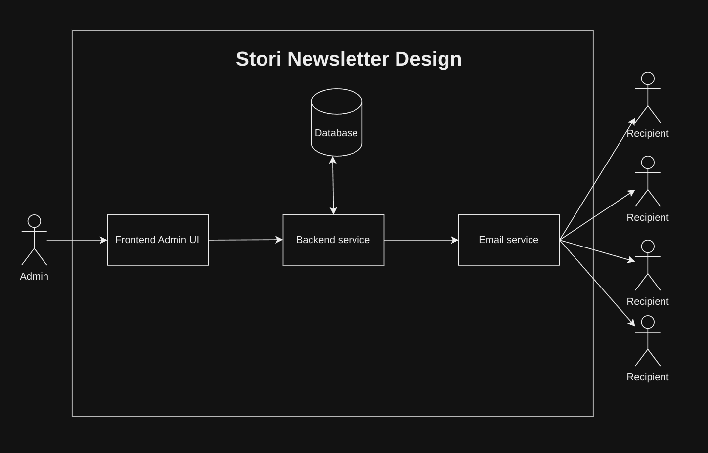
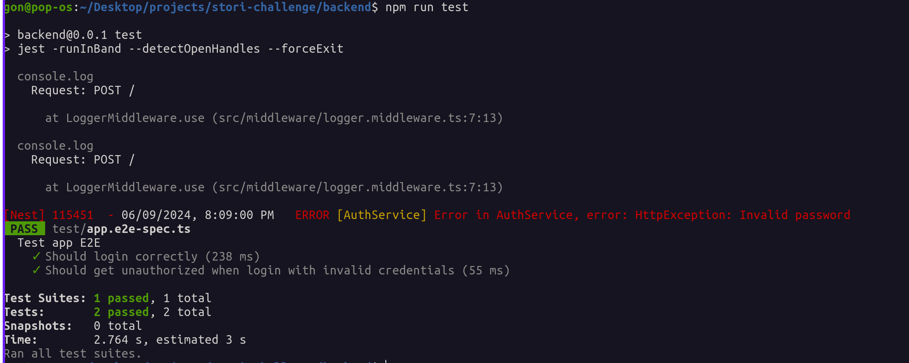
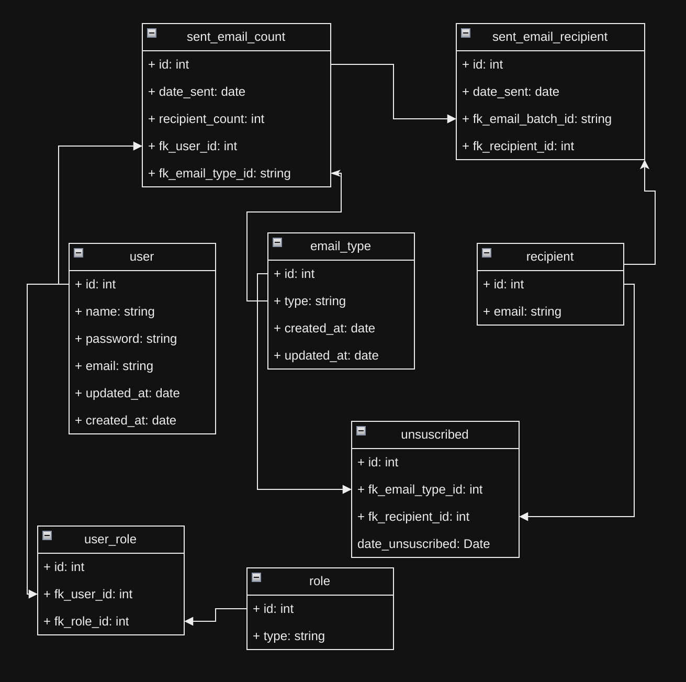

# Newsletter

The Stori Challenge is to build a Newsletter app. Here's an overview of how it works:

The app consists of a Frontend (Vue3, Vite, Vue Router, Vuetify) connected to a Backend REST API (Nestjs), which in turn is connected to a PostgreSQL database and an email service provider (Mailtrap). I chose to use a third-party email provider instead of building my own SMTP server to avoid handling reputation and mail rejections from providers like Gmail and Hotmail.

The project has the following folder structure:

- docker-compose
- readme
  - Backend
  - Frontend

Each backend and frontend has its own Dockerfile, and the root project contains a Docker Compose file that builds all the necessary dependencies.

To run this project locally, you need the following dependencies:

1. Docker
2. Docker Compose
3. Node 20
4. Npm 10

Follow these steps to run the project:

1. Go to [https://github.com/GonzaloGorgojo/stori-challenge](https://github.com/GonzaloGorgojo/stori-challenge)
2. Clone the repository to your local machine
3. Run the command `docker compose up -d`
4. Go to [localhost:5173](http://localhost:5173)
5. Test it out! 😊

Example video:
https://github.com/GonzaloGorgojo/stori-challenge/assets/49298587/ea683b3d-4e48-4605-9b8e-bacb3c944989

If you want to develop on project you need to do this steps:

1. Clone repo
2. if you want to work on both backend and frontend go to docker compose file and comment backend and frontend services
3. docker compose up -d (this will only create the Postgresql image)
4. go to backend folder, create .env file with the ones in the example and run `npm install` then `npm run typeorm:run` then `npm run start:dev`.
5. go to frontend folder and run `npm install` then `npm run dev`
6. To run end to end test (only backend for now) go to backend folder and run `npm run test`,example: 

This is the Database entity relationshop diagram:

