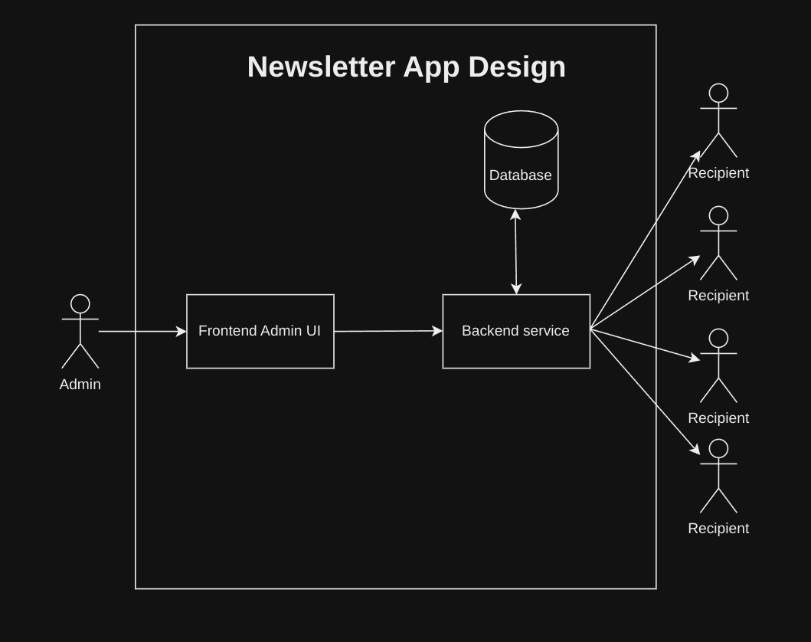

# Newsletter

<h3>This is a Newsletter app. Here's an overview of how it works:</h3>

The app consists of a Frontend (Vue3, Vite, Vue Router, Vuetify) connected to a Backend REST API (Nestjs), which in turn is connected to a PostgreSQL database. To send the emails I have choosen [Mailtrap](https://mailtrap.io/sending/domains/0b94bf50-a0a0-4cde-a5f2-0d553f73bcd5?current_tab=smtp_settings&stream=bulk) API service, instead of going with pure SMTP, this will help me to sort some difficulties when trying to send email (providers dont trust any source of emails).

<h4>The project has the following folder structure:</h4>

- docker-compose
- readme
  - Backend
  - Frontend

Each backend and frontend has its own Dockerfile, and the root project contains a Docker Compose file that builds all the necessary dependencies.

<h4>To run this project locally, you need the following dependencies:</h4>

1. Docker
2. Docker Compose
3. Node 20
4. Npm 10

<h4>Follow these steps to run the project:</h4>

1. Go to [https://github.com/GonzaloGorgojo/nest-vue-newsletter](https://github.com/GonzaloGorgojo/nest-vue-newsletter)
2. Clone the repository to your local machine
3. Run the command `docker compose up -d`
4. Go to [localhost:5173](http://localhost:5173)
5. Test it out! 😊

<h4>If you want to develop on project you need to do this steps:</h4>

1. Clone repo
2. if you want to work on both backend and frontend go to docker compose file and comment backend and frontend services
3. docker compose up -d (this will only create the Postgresql image)
4. go to backend folder, create .env file with the ones in the example.env and run `npm install` then `npm run typeorm:run` then `npm run start:dev`.
5. go to frontend folder and run `npm install` then `npm run dev`
6. To run end to end test (only backend for now) go to backend folder and run `npm run test`,example: 

<h4>This is the Database entity relationshop diagram:</h4>

